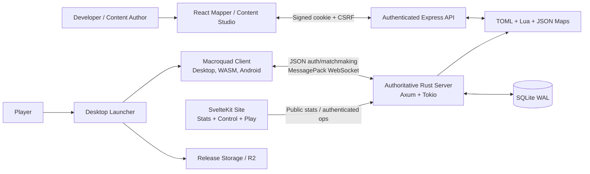
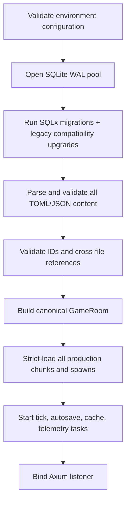
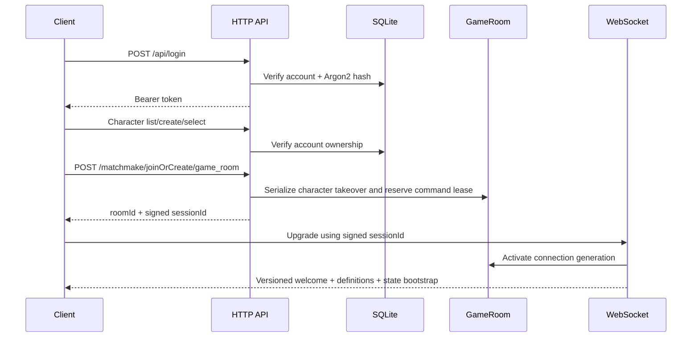

# Aeven Architecture

This document describes the current production architecture. Historical files
under `docs/` are useful context but are not authoritative.

## Design Invariants

1. The server owns game truth. Clients send intent, never outcomes.
2. Every mutation is checked against identity, ownership, instance, position,
   timing, resources, and progression as applicable.
3. Private state is unicast. Shared state is scoped to the smallest relevant
   room, instance, and visibility set.
4. Required configuration, schema, maps, and content fail before traffic is
   accepted.
5. Wire and persistence formats are explicit compatibility boundaries.
6. Platform shells may differ; replicated gameplay and frame behavior remain
   shared.
7. Tick work is bounded, measured, and kept separate from blocking I/O.
8. Privileged tools are authenticated, scoped, CSRF-protected, and local-first.

## System Topology



The deployed game is one authoritative process, one canonical room aggregate,
in-memory connection/session ownership, and one SQLite database. This is a
deliberate vertical architecture. Horizontal replication requires shared
session ownership, distributed room placement, inter-process publication, and
a persistence strategy beyond a single SQLite writer.

## Components

### Server

`rust-server/` owns simulation, validation, persistence, and all authoritative
content.

| Path | Responsibility |
| --- | --- |
| `src/main.rs` | Process boot, Axum routes, tick/autosave/telemetry tasks |
| `src/config.rs` | Validated environment configuration and trusted proxies |
| `src/app_state.rs` | Process services, room creation, sessions, shared content |
| `src/content.rs` | Immutable registry loading and cross-reference validation |
| `src/server_auth.rs` | Accounts, Argon2 passwords, bearer auth sessions |
| `src/characters.rs` | Character ownership and lifecycle APIs |
| `src/matchmaking.rs` | Admission, takeover serialization, signed room leases |
| `src/websocket.rs` | Upgrade validation, bootstrap, receive/send lifecycle |
| `src/game.rs`, `src/game/` | `GameRoom` aggregate and domain operations |
| `src/game/transport.rs` | Bounded unicast/broadcast transport and sync state |
| `src/instances.rs` | Overworld, public interiors, private instances |
| `src/protocol/` | Server events, encoding, state sync |
| `src/db/` | Typed SQLx persistence and snapshots |
| `src/world.rs` | Strict chunk loading, collision, visibility/world queries |
| `src/perf_metrics.rs` | Tick, save, handler, send, movement, and sync metrics |

`GameRoom` remains the simulation aggregate root. Gameplay behavior is split
into domain modules such as movement, combat, inventory, trade, shops, quests,
farming, Slayer, arenas, bosses, and transport. New systems should own their
mutable state behind operations instead of exposing locks or adding unrelated
logic to the aggregate constructor.

### Client

`client/` is one Rust crate targeting desktop, WASM, and Android.

| Path | Responsibility |
| --- | --- |
| `src/desktop.rs` | Native shell, spectator backdrop, lifecycle, frame pacing |
| `src/lib.rs` | WASM/Android entrypoints and platform lifecycle |
| `src/app.rs` | Shared state construction, settings, tutorial boot |
| `src/gameplay.rs` | Shared authoritative-message/input/update/render frame |
| `src/game/` | Replicated world and presentation state |
| `src/network/` | HTTP/matchmaking/WebSocket adapters and message handling |
| `src/input/` | Input interpretation and outbound commands |
| `src/render/` | Isometric renderer, effects, world, and UI composition |
| `src/ui/` | Login, character, HUD, panels, and dialogs |
| `src/audio/` | Music/SFX loading and playback |
| `web/` | Browser shell and JavaScript bridges |
| `android/` | Android project integration |

All platforms construct gameplay state through `app::new_game_state` /
`configure_game_state` and execute active gameplay through `run_game_frame`.
Platform shells retain only real differences: browser matchmaking/storage,
Android scaling/touch lifecycle, and desktop spectator/frame pacing.

### Shared Protocol

`crates/aeven-protocol/` is a wire-only crate used by client and server. It
contains:

- The `ClientMessage` command enum
- Stable message names and field aliases
- Strict MessagePack envelope encoding/decoding
- A 64 KiB inbound command limit
- `PROTOCOL_VERSION`
- Round-trip and malformed-payload tests

It must not contain server domain objects or presentation state.

### Mapper

`mapper/` contains the React editor and `mapper/server/` Express API. It edits
working map data, structured content, notes, sprites, and atlases.

The API:

- Binds to `127.0.0.1` unless configured otherwise
- Loads users from `MAPPER_USERS` or ignored `mapper/users.json`
- Requires scrypt password hashes in production
- Uses HMAC-signed, expiring, `HttpOnly`, `SameSite=Strict` sessions
- Uses double-submit CSRF protection for mutations
- Rate-limits failed login attempts
- Restricts users to configured worlds
- Validates IDs, coordinates, payload sizes, image structure, and paths
- Serializes asset mutations and uses atomic JSON/directory replacement

It is a privileged development service, not part of the public game data plane.

### Site And Launcher

`site/` is a static SvelteKit application:

- `/` marketing/homepage
- `/play/` packaged browser client
- `/world/` public server statistics
- `/control/` bearer-authenticated operational views

`launcher/` downloads a release manifest, selects the platform artifact,
verifies SHA-256 hashes, installs versioned files, and launches the client.

## Server Startup



Startup aborts on invalid production secrets, database migration failure,
missing required content, duplicate IDs, malformed maps, unknown entity/item/
chest/quest/gathering references, or broken portal destinations. Existing but
invalid chunks are never replaced by generated development chunks.

Debug builds enable quest-file hot reload and may synthesize genuinely missing
chunks for isolated development. Optimized builds never synthesize missing
authoritative map data.

## Configuration And Security

Server environment:

| Variable | Purpose |
| --- | --- |
| `AEVEN_ENV` | `development` or `production`; release defaults to production |
| `AEVEN_BIND_ADDR` | Listener, default `0.0.0.0:2567` |
| `AEVEN_DATABASE_URL` | SQLx SQLite URL, default `sqlite:game.db?mode=rwc` |
| `AEVEN_ALLOWED_ORIGINS` | Comma-separated exact CORS origins; no wildcard |
| `AEVEN_SESSION_SIGNING_SECRET` | HMAC secret, required in production, 32+ bytes |
| `AEVEN_ADMIN_API_TOKEN` | Enables ops routes, 32+ characters |
| `AEVEN_AUTH_SESSION_TTL_HOURS` | In-memory bearer lifetime, 1-720 hours |
| `AEVEN_TRUSTED_PROXIES` | Exact proxy IPs allowed to supply forwarding headers |

Untrusted peers cannot override their source IP through forwarding headers.
Authentication is rate-limited per resolved client IP. Matchmaking verifies the
bearer session, character ownership, ban state, online ownership, and a signed
short-lived room admission before WebSocket activation.

Auth sessions, room admissions, command leases, online-character ownership, and
active sockets are process-local. Restarting the server invalidates them.

## Connection Lifecycle



Each connection receives a bounded private channel and a scoped room broadcast
subscription. Disconnect cleanup and saving only proceed when that connection
still owns the character command lease, preventing an old socket from removing
a newer takeover session.

## Realtime Protocol

Frames use the envelope:

```text
[13, "messageType", { ...payload }]
```

Client-to-server commands are shared and strictly decoded by
`aeven-protocol`. Unknown variants, missing required fields, wrong types,
oversized frames, trailing bytes, and invalid envelopes are rejected.

Server-to-client events use server-owned typed variants and optimized `rmpv`
encoders, then client handlers decode into presentation state. This direction
is intentionally not a shared domain enum because many payloads are
bandwidth-oriented projections. Its compatibility protection is:

- A version in the initial welcome message
- Immediate client rejection on version mismatch
- Stable event names and field semantics
- Encoder and representative client-decoder tests
- Required `PROTOCOL_VERSION` increment for incompatible changes

This is an explicit boundary: adding a server event requires coordinated
encoder, client handler, and compatibility tests in the same change.

## Authority And Command Handling

The client may request movement, attacks, interactions, purchases, trades,
crafting, travel, or dialogue choices. The server derives success and all
resulting state.

Handlers validate the relevant combination of:

- Authenticated account, selected character, and active command lease
- Instance membership and target visibility
- Position, collision, range, and line of sight
- Cooldown, action state, sequence number, and stale input
- Inventory quantity/capacity, currency, equipment, and ownership
- Skill, quest, Slayer, spell, prayer, and content requirements
- Trade counterpart/session state
- Replay, duplicate, stale, and cross-instance requests

Damage, XP, rewards, loot, prices, drops, completion, and final positions are
never accepted from the client.

## Tick And Synchronization

The simulation runs at 20 Hz with a 50 ms budget and
`MissedTickBehavior::Delay`, preventing catch-up bursts after a slow tick.
Phases cover movement, actions, combat, NPC/world AI, resources, farming,
instances, bosses, arenas, cleanup, and outbound synchronization.

`RoomTransport` owns connection senders, room publication, spectator
publication, and per-player synchronization state. State sync:

- Filters by room instance and visibility radius
- Sends periodic full snapshots and intermediate deltas
- Falls back to self-only state when appropriate
- Compresses larger payloads
- Uses bounded channels and non-blocking backpressure accounting
- Tracks full/delta counts, skipped sends, dropped sends, and byte ratios

The release-mode 128-player synthetic gate runs 100 complete room ticks. The
June 11, 2026 result was:

```text
average  13.48 ms
p95      16.08 ms
p99      17.44 ms
maximum  19.34 ms
budget   50.00 ms
```

This proves current single-process simulation headroom under the fixture. It
does not replace soak, network, database saturation, hostile-client, or
multi-process testing.

## Persistence

SQLite is configured with:

- WAL journal mode
- `NORMAL` synchronous mode
- Foreign keys enabled
- Five pooled connections
- Five-second busy/acquire timeouts

`sqlx::migrate!` applies numbered migrations from `rust-server/migrations/`.
Legacy installations receive narrowly scoped, introspected compatibility
upgrades and one-time data consolidation after migrations.

The server snapshots player state under room locks, releases locks, then
performs serialized writes. Autosave runs every 30 seconds. Disconnect and
graceful shutdown also save current state. Related persistence methods use
typed records/parameters and transactions where atomicity spans multiple rows.

SQLite is appropriate for the current single-writer deployment. Multiple game
server writers require a different persistence topology.

## Content Architecture

`ContentRegistries` loads immutable registries once and shares them through
`Arc` with HTTP handlers and rooms. It owns entities, items, prayers, quests,
crafting, chests, interiors, and collection-log definitions.

Validation occurs in layers:

1. Every TOML and JSON file parses.
2. Typed registries reject missing directories, empty registries, duplicate IDs,
   invalid ranges, and malformed definitions.
3. Cross-reference checks validate item, entity, chest, quest, collection-log,
   interior, spawn, gathering-zone, and portal references.
4. Production room bootstrap loads every runtime subsystem and every world
   chunk.

Runtime systems such as shops, gathering, farming, mining, woodcutting, Slayer,
scroll spells, ground spawns, waystones, dig sites, orders, and crate loot load
with contextual fatal errors. The production bootstrap test exercises this
entire path without opening a listener.

### Maps

Overworld chunks are version `2`, exactly `32x32`, and named
`chunk_<x>_<y>.json`. The server verifies:

- Payload coordinates match the filename
- All three tile layers contain exactly 1,024 `u32` values
- Packed collision is valid Base64 and exactly 128 bytes
- Optional height/block arrays have exact dimensions
- Entity and gathering coordinates are local and bounded
- Objects and walls have valid numeric fields
- Portals deserialize and reference existing destinations/spawns
- Spawned entities and gathering markers reference registered definitions

Interiors declare dimensions, instance policy, spawn points, portals, layers,
collision, entities, objects, walls, chests, and optional elevation. Their
arrays and references are validated before room construction.

## Instances

The overworld is the default shared instance. Interior definitions choose
`public` or `private` policy. `InstanceManager` owns active instances while
player-to-instance and entrance-position maps support scoped synchronization
and return travel.

Every interaction checks instance context. NPCs, ground items, chests, trades,
combat targets, and events must not leak across instance boundaries.

## Client State And Rendering

The client keeps:

- Replicated authoritative state
- Interpolation and transient visual effects
- Input state and outbound intent
- UI/navigation state
- Platform settings and local caches

`run_game_frame` is the common active-game pipeline. Network messages update
the smallest owning state area available; input produces protocol commands;
rendering consumes a snapshot of local state. Client prediction is
presentation-only and must converge on the next authoritative update.

Platform entrypoints may manage different login/matchmaking adapters, storage,
touch scaling, or frame pacing, but they must call the shared state constructor
and gameplay frame.

## Observability

The server records rolling summaries for:

- Tick loop and per-room phase duration
- Autosave snapshot/write/total duration
- Command handler and WebSocket send duration
- Connected/overworld/instance/spectator load
- Movement rejection reasons and stale/sequence anomalies
- State-sync full/delta/fallback counts, drops, skips, and compression
- Slow-operation counters and contextual warnings

Every 60 seconds it emits a structured performance summary. Authenticated
`/api/perf`, `/api/logs`, and `/api/admin/*` expose operational snapshots only
when `AEVEN_ADMIN_API_TOKEN` enables those routes.

## Extension Patterns

### Add A Client Command

1. Add the DTO and stable wire name to `aeven-protocol`.
2. Add round-trip, malformed, and alias tests.
3. Dispatch it in the server command layer.
4. Validate authority in the owning gameplay module.
5. Emit scoped server events.
6. Increment `PROTOCOL_VERSION` if old peers cannot remain compatible.

### Add A Server Event

1. Add the server projection and encoder.
2. Choose private, instance/spatial, room, or global scope deliberately.
3. Add the client handler in the owning state module.
4. Test the encoder and representative client decoding.
5. Increment the protocol version for incompatible semantics.

### Add A Gameplay System

1. Define a state-owning service/manager.
2. Expose commands and narrow queries, not locks.
3. Define its tick phase and budget if it ticks.
4. Define persistence snapshots if durable.
5. Register immutable definitions in content loading.
6. Add graph validation for every referenced ID.
7. Add unit, integration, bootstrap, and capacity coverage proportional to risk.

### Change Persistent Data

1. Add a new numbered SQLx migration.
2. Keep already-released migrations immutable.
3. Test fresh creation and upgrade from the previous schema.
4. Preserve serialized compatibility or migrate it explicitly.
5. Keep multi-row invariants in transactions.

## Delivery Architecture

`CI` is the required upstream workflow. It validates Rust, WASM, content,
capacity, mapper, mapper API, site, and dependency audits. Deployment and
automatic client/launcher releases use `workflow_run` and proceed only after a
successful CI run on `master`. Release workflows re-check whether relevant
paths changed before building artifacts.

`deploy.sh` fast-forwards only to the exact CI-tested SHA, verifies that it is
reachable from `origin/master`, uses pinned Node/npm major versions and locked
dependencies, compiles explicit release endpoints, and restarts the server
through systemd.

## Scaling Boundaries

The current architecture is production-suitable for one authoritative process.
These are boundaries to preserve explicitly rather than hide:

- In-memory auth/session/lease state prevents transparent multi-process failover.
- SQLite assumes one game-server writer.
- `GameRoom` is still a broad aggregate; new domains must continue moving state
  behind owned services.
- Server-to-client projections are coordinated rather than generated from one
  shared schema, so protocol tests and version discipline are mandatory.
- Capacity coverage is synthetic; scheduled soak and adversarial tests are the
  next operational maturity step.
