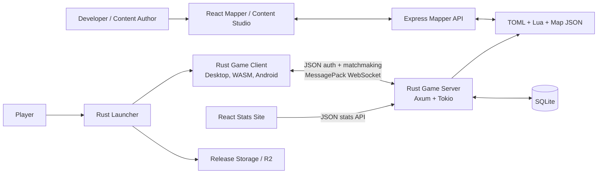
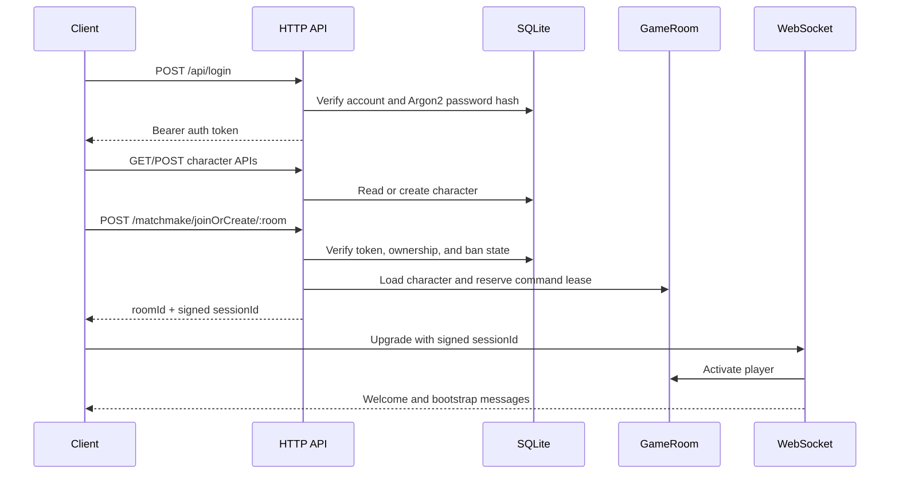

# Aeven Architecture

This document describes the codebase as it exists on June 11, 2026. It is both a
runtime reference and an engineering audit. Historical plans in `docs/` may
describe earlier versions of the project and are not authoritative.

## Architectural Principles

The codebase should preserve these rules while it is modernized:

1. The server owns game truth. Clients send intent, never authoritative state.
2. Persistence, inventory, rewards, combat, movement, and access checks are
   validated server-side.
3. Private player state is sent through per-connection channels; public world
   events are scoped to the smallest useful audience.
4. Data-driven content is validated before it becomes live game state.
5. Wire contracts and stored data are versioned compatibility boundaries.
6. Platform differences belong behind adapters, not in separate game loops.
7. Gameplay systems should own their state and expose narrow commands, queries,
   and events.
8. Production must fail closed on authentication and fail fast on required
   content or schema failures.

## System Context



The game runtime is currently one server process with one canonical game room,
in-memory session and instance state, and one SQLite database. This is a valid
vertical-scaling architecture, but it is not horizontally scalable without
additional coordination.

## Components

### Game Server

`rust-server/` is the authoritative game simulation and persistence boundary.

Key modules:

| Path | Responsibility |
| --- | --- |
| `src/main.rs` | Boot, routes, tick/autosave tasks, shared `AppState` |
| `src/server_auth.rs` | Account authentication and bearer sessions |
| `src/matchmaking.rs` | Character ownership, takeover, room admission |
| `src/websocket.rs` | Session upgrade, bootstrap, send/receive lifecycle |
| `src/protocol/` | MessagePack decoding and server message encoding |
| `src/game.rs`, `src/game/` | `GameRoom` and gameplay command/tick systems |
| `src/instance.rs` | Overworld, private interiors, and shared instances |
| `src/game/tick.rs`, `src/protocol/state_sync.rs` | Visibility filtering, deltas, compression, backpressure |
| `src/db/` | SQLite setup, reads, and player persistence |
| `src/quest/` | Quest definitions, state, registry, and Lua runner |
| `src/*_registry.rs` | Data-driven gameplay definitions |
| `src/world.rs` | Chunk loading, collision, and world queries |

At startup the server:

1. Initializes tracing and the in-memory log buffer.
2. Opens SQLite in WAL mode through SQLx.
3. Creates or updates tables through startup schema statements.
4. Loads maps, interiors, items, entities, recipes, shops, quests, spells,
   prayers, and other gameplay registries.
5. Builds the canonical `GameRoom` and shared `AppState`.
6. Starts a 20 Hz game tick and a 30-second autosave task.
7. Starts the Axum HTTP and WebSocket listener on port `2567`.

### Game Client

`client/` is a Macroquad application with native desktop, WASM, and Android
targets.

Key modules:

| Path | Responsibility |
| --- | --- |
| `src/main.rs` | Desktop executable boot and application state |
| `src/lib.rs` | Library entrypoint used by WASM and Android |
| `src/main_runtime.rs` | Desktop frame runtime |
| `src/app.rs` | Library/WASM/Android frame runtime |
| `src/game/` | Client world model and interpolation |
| `src/network/` | Matchmaking, WebSocket, wire encoding, message handlers |
| `src/input/` | Input interpretation and outbound command creation |
| `src/render/` | Isometric transforms, world rendering, effects, UI layers |
| `src/ui/` | Login, character selection, panels, HUD, and dialogs |
| `src/audio/` | Music and sound queues |
| `src/assets/` | Atlas and asset loading |
| `web/` | Browser shell and JavaScript auth/network bridges |
| `android/` | Android project integration |

The client holds a large presentation-side `GameState`. It interpolates toward
server positions, renders local effects, and predicts presentation only. It
must not decide whether an action succeeds.

### Mapper And Content Studio

`mapper/` contains:

- A React/TypeScript world editor and content studio
- A Zustand editor store
- Chunk and interior editing
- Asset importing and atlas rebuilding
- TOML item, entity, recipe, spell, shop, and balance tooling
- Cross-content validation
- An Express API in `mapper/server/` that reads and writes repository files

The Express process is a privileged development tool. It can mutate game data,
maps, and assets and can run synchronization/deployment operations. It is not a
public game service.

### Public Stats

The unified `site/` SvelteKit app (under `/world/`) consumes the server's
read-only `/api/stats/*` endpoints for overview data, online players,
leaderboards, item and entity catalogs, and player profiles.

### Launcher And Release Tools

`launcher/` checks the public server, reads a release manifest, downloads
versioned client files, verifies SHA-256 hashes, and launches the installed
client. Python utilities in `tools/` create client packages, launcher archives,
and merged manifests for Cloudflare R2.

## Runtime Flows

### Authentication And Character Admission



Bearer authentication tokens, room reservations, command leases, online
characters, and active WebSocket sessions are held in process memory. A server
restart invalidates them.

The signed matchmaking token prevents a client from inventing a room admission,
but the signing secret is generated at process startup. Multiple server
replicas would need a shared secret and coordinated session ownership.

### WebSocket Lifecycle

After the signed session is validated, the server:

1. Activates the player and establishes command ownership.
2. Creates a bounded per-connection `mpsc` channel for private messages.
3. Subscribes the connection to room broadcasts.
4. Sends definitions and initial state: welcome, character state, maps,
   entities, items, recipes, inventory, equipment, skills, quests, shops,
   prayers, spells, contracts, and other registries.
5. Decodes client MessagePack commands and dispatches them to authoritative
   handlers.
6. Sends pings and enforces connection timeouts.
7. Saves and removes the player on disconnect when the connection still owns
   the command lease.

Private data such as inventory and progression should use unicast messages.
Spatial events should use instance- and visibility-scoped publication. Global
broadcasting is reserved for truly global events.

### Protocol

Realtime frames use the Colyseus-style shape:

```text
[13, "messageType", { ...payload }]
```

The client manually converts `ClientMessage` variants into message names and
`rmpv` maps in `client/src/network/messages.rs`. The server manually matches
those names and extracts fields in `rust-server/src/protocol/decode.rs`.
Server-to-client messages are similarly encoded and dispatched by hand.

This is currently a compile-time blind spot: the two crates can compile and
test independently while disagreeing on names, fields, defaults, or numeric
representations. There is no protocol version handshake and no end-to-end
compatibility suite.

### Tick And State Synchronization

The server uses a 20 Hz interval with a 50 ms deadline. Tick responsibilities
include movement, auto-actions, combat, NPC AI, spawning, gathering, farming,
bosses, arenas, timed objects, instance state, and outbound synchronization.

Movement advances on a five-tick cadence, or approximately 250 ms. The client
renders at its frame rate and interpolates between authoritative grid
positions.

State synchronization:

- Filters entities by instance and a visibility radius
- Keeps per-player sync state
- Sends full snapshots when required and deltas otherwise
- Compresses larger sync payloads
- Uses bounded channels and backpressure-aware delivery
- Records tick and synchronization performance metrics

The June 11, 2026 release-mode capacity test simulated 128 players:

```text
average  12.33 ms
p95      14.66 ms
p99      18.07 ms
maximum  18.33 ms
budget   50.00 ms
```

This test measures one process under a synthetic workload. It does not validate
database saturation, internet latency, multi-hour memory behavior, denial of
service resistance, or multi-process coordination.

### World And Instances

The overworld is split into 32x32 JSON chunks under
`rust-server/maps/world_0/`. Interiors are JSON maps under
`rust-server/maps/interiors/`.

`InstanceManager` separates:

- The canonical overworld
- Private interiors owned by a player or activity context
- Shared interiors and activity instances
- PvP, arena, boss, and other isolated encounter contexts

Every command involving another entity or object must validate that both sides
share the correct instance and are within the system-specific range. A global
ID lookup without an instance check is not sufficient.

### Gameplay And Content

Most definitions are loaded from `rust-server/data/`:

- Items, equipment, consumables, materials, seeds, and tools
- Entities, attacks, loot tables, and ground spawns
- Recipes, crafting stations, and production orders
- Shops, chests, crates, chairs, waystones, and interactions
- Gathering, fishing, mining, farming, and woodcutting definitions
- Prayers, spells, PvP zones, Slayer masters, and Slayer rewards
- Quest metadata and Lua scripts

The server sends many registries to the client during bootstrap so the client
can render names, icons, recipes, and UI details without owning the outcome of
gameplay rules.

Loader policy is currently inconsistent. Some required registries abort
startup, while others log an error and continue with empty content. Production
should validate a complete content graph and fail startup when required content
is missing or internally inconsistent.

### Persistence

SQLite is configured in WAL mode with a small SQLx pool. Character state is
saved:

- Every 30 seconds
- During command-lease takeover
- On WebSocket disconnect
- During spectator-to-player transitions
- During graceful shutdown

State is spread across normalized tables and serialized JSON columns. Startup
schema management currently consists of many inline `CREATE TABLE` and
`ALTER TABLE` statements in `src/db/setup.rs`. Several migration operations
discard errors to remain idempotent.

The persistence layer needs a versioned migration history and a single
transactional player snapshot API. Today, save orchestration is duplicated
across connection and process lifecycle paths, and the central save method has
an excessively wide parameter list.

## Ownership And Extension Rules

### Adding A Client Command

Until a shared protocol crate exists:

1. Add or update the client `ClientMessage` variant.
2. Update client MessagePack encoding.
3. Update server decoding and validation.
4. Dispatch to a domain handler that checks authentication, command lease,
   instance, range, ownership, quantities, cooldowns, and idempotency.
5. Add encoder/decoder fixtures on both sides.
6. Test malformed, stale, duplicate, cross-instance, and unauthorized inputs.

Never use a client-supplied reward, damage amount, price, level, position, or
ownership claim without deriving or verifying it on the server.

### Adding A Server Event

Choose its audience first:

- Unicast for private state and command results
- Instance- or zone-scoped for spatial activity
- Room broadcast only for global announcements

Then update server encoding, client dispatch, and the relevant client state
slice. Events should carry stable IDs and enough context to reject stale
updates.

### Adding A Gameplay System

Do not add another unrelated collection and lock directly to `GameRoom` by
default. Prefer a system type that owns its state:

```text
Command -> DomainSystem -> DomainEvents
                      \-> PersistenceChanges
```

A system should expose:

- Explicit commands and validated inputs
- Read-only queries needed by other systems
- A bounded tick phase if it needs ticking
- Domain events instead of direct UI/protocol knowledge
- Snapshot data needed for persistence

Cross-system access should flow through a narrow context or command/event API,
not broad `use super::*` imports and arbitrary lock access.

### Adding Content

1. Edit through the content studio when an editor exists.
2. Keep IDs stable after release.
3. Validate all references, including drops, recipes, shops, spawns, quests,
   assets, and maps.
4. Confirm both startup loading and client bootstrap behavior.
5. Add a focused loader or registry test.
6. Review generated files and atlas changes before committing.

### Changing The Database

The current inline schema mechanism is legacy. A schema change must be
idempotent, tested against a fresh database and an upgraded database, and must
not silently discard unexpected errors. The target mechanism is checked-in,
numbered SQL migrations executed by `sqlx::migrate!`.

## Architecture Audit And Modernization Plan

### P0: Release And Security Blockers

#### Client endpoints are hard-coded to localhost

Both desktop and library entrypoints currently compile
`http://localhost:2567` and `ws://localhost:2567`. The release workflow builds
the source without replacing them, so a release from the current branch would
connect players to their own machine.

Replace these constants with one typed configuration module populated by build
profile or environment. CI must assert that release artifacts contain approved
production endpoints and never localhost.

#### Mapper mutation APIs bypass authentication

The mapper server currently allows `/api/*` and `/mapper/api/*` through its
authentication middleware. Those routes can write maps, content, and assets and
can trigger synchronization operations.

Keep the mapper bound to localhost until this is fixed. Production-safe tooling
requires authenticated mutation routes, hashed credentials or an external
identity provider, secure cookies, CSRF protection, explicit origin checks, and
separate read/write privileges.

### P1: Structural Risks

#### Client runtime duplication

Desktop runs through `main.rs` and `main_runtime.rs`; WASM and Android run
through `lib.rs` and `app.rs`. Their frame loops have already diverged in
tutorial, fullscreen, FPS, debug animation, and spectator behavior.

Target: one `Application` and one frame pipeline with platform adapters for
storage, auth, networking, windowing, and lifecycle.

#### Protocol duplication

More than 80 command/event names and their fields are manually mirrored across
client and server. Dead and partially implemented variants already exist.

Target: a Cargo workspace with a shared `protocol` crate containing serde wire
DTOs, a negotiated protocol version, round-trip tests, and golden compatibility
fixtures. Domain types should remain private to the server.

#### `GameRoom` is a central ownership bottleneck

The file split reduced individual module size, but `GameRoom` still owns most
gameplay state through dozens of locks, and many modules implement it with
`use super::*`. New systems continue to increase central coupling.

Target: domain-owned systems such as world, combat, economy, progression,
activities, and social services with explicit tick phases and events. This does
not require an immediate ECS rewrite.

#### Persistence and migrations are fragile

Schema changes run as ad hoc startup SQL, some errors are ignored, save
orchestration is duplicated, and the player save API is too wide.

Target: versioned SQL migrations, fail-fast migration status, a
`PlayerSnapshot` value object, repository methods, and one transaction per
logical save.

#### Content can fail open

Some registry failures result in an empty system and a running server. That can
turn a content deployment error into a partially functional live world.

Target: define required and optional registries, run headless graph validation
in CI, and make production startup atomic with respect to required content.

#### Single-process scaling is implicit

Rooms, sessions, leases, instances, and signing secrets are process-local, the
room tick is serial, and SQLite is a single-writer database.

Target when capacity requires it: choose explicit world shards, use sticky
routing, externalize account/session coordination, move durable state to a
multi-writer service, and define cross-shard social/event semantics. Do not add
generic replicas before these ownership rules exist.

#### Operational endpoints and proxy identity

Performance and in-memory log endpoints are public, CORS permits all origins,
and rate limiting relies on socket addresses. Behind a reverse proxy, the
socket address may identify the proxy rather than the player.

Target: authenticate operational endpoints, restrict CORS, introduce trusted
proxy configuration, and use structured metrics/log export instead of exposing
process internals publicly.

### P2: Maintainability And Delivery Debt

- `GameState` and the mapper Zustand store are broad mutable state containers.
- Rust builds emit roughly 150-200 warnings depending on target.
- Mapper lint currently reports 28 errors and 3 warnings.
- Several source files remain above 1,000 lines.
- Deployment runs on `master` without required test, lint, or build gates.
- `Cargo.lock` is ignored even though the Rust packages are applications.
- Rust and Node toolchains are not pinned consistently.
- Built WASM binaries are tracked under three ambiguous filenames.
- Mapper and stats package documentation is still generated-template content.
- Some critical send, migration, and save results are intentionally discarded
  without distinguishing best-effort work from correctness requirements.

These issues make regressions harder to see. Establish a clean warning/lint
baseline, pin toolchains and lockfiles, remove generated artifacts from source
control where practical, and make the complete validation matrix a protected
merge requirement.

## Recommended Sequence

1. Fix production endpoint configuration and mapper/server endpoint exposure.
2. Add CI that runs the current validation matrix and blocks deployment.
3. Create a shared versioned protocol crate with compatibility tests.
4. Unify the client application runtime behind platform adapters.
5. Introduce versioned migrations and a transactional player snapshot.
6. Extract one high-change gameplay domain from `GameRoom` at a time.
7. Split client and mapper state by domain and replace broad imports.
8. Design sharding only after real production metrics exceed the current
   single-process capacity envelope.

The existing authoritative validation, instance isolation, scoped
synchronization, content registries, performance instrumentation, and test
coverage are good foundations. The next phase should improve boundaries and
delivery discipline rather than rewrite the game wholesale.
